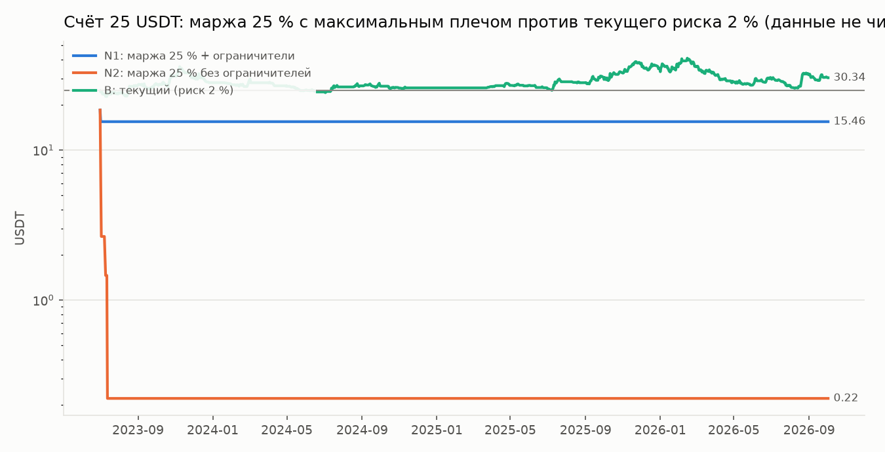
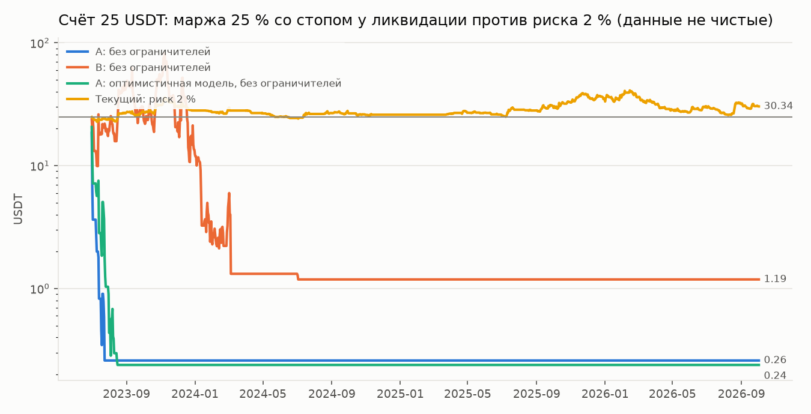

# Проверка правила «маржа 25 % баланса, плечо максимальное»

Запрос пользователя (2026-10-02): на каждую сделку ставить маржу 25 % баланса, плечо
максимальное, не больше 4 позиций. Перед внесением в бота правило прогнано на истории.
Скрипт — `python -m research.margin25`, вывод — `reports/margin25.txt`.

**Данные не чистые:** вся история уже использовалась в исследовании.

## Результат (счёт 25 USDT, стратегия и правило ликвидности те же)

| Вариант | 25 USDT → | Сделок | Ликвидаций | Прибыльных | Остановка |
|---|---|---|---|---|---|
| N1: маржа 25 % + дневной лимит 6 %, просадка 20 % → маржа 12,5 %, 40 % → остановка | 15,46 | 3 | 2 | 0 | 2 июля 2023, на второй день |
| N2: маржа 25 % без ограничителей счёта | 0,22 | 14 | 13 | 0 | капитал потерян за 12 дней |
| B: текущий (риск 2 %, сумма ≤ 6 %) | 30,34 | 329 | 0 | 33 % | нет |

N2 со стартом в разные даты (без ограничителей):

| Старт | −40 % через | −90 % через | Сделок / ликвидаций / прибыльных | Итог |
|---|---|---|---|---|
| 2023-07-01 | 1 день | 8 дней | 14 / 13 / 0 | 0,22 |
| 2024-01-01 | 10 дней | 17 дней | 14 / 12 / 1 | 0,47 |
| 2024-07-01 | 1 день | 3 дня | 20 / 17 / 1 | 0,33 |
| 2025-01-01 | 1 день | 1 день | 10 / 10 / 0 | 0,00 |
| 2025-07-01 | 1 день | 2 дня | 8 / 8 / 0 | 0,00 |
| 2026-01-01 | 0 дней | 13 дней | 16 / 15 / 1 | 0,01 |

## Почему так

- Плечо 75 даёт ликвидацию через 0,28–0,61 % движения против позиции (у большинства монет корзины
  0,53–0,61 %: 1/75 минус ставка поддерживающей маржи 0,67–1 % и комиссия закрытия). *Исправлено
  2026-10-02: раньше здесь было «примерно 1,3 %» — это 1/75 без учёта поддерживающей маржи; расчёт
  в бэктесте её учитывал, ошибка была только в тексте.*
- Стоп стратегии стоит дальше, в среднем на 6,3 %. Стратегия рассчитана на то, что цена
  может отойти против позиции на несколько процентов, прежде чем пойдёт тренд.
- Поэтому почти каждая сделка ликвидируется раньше стопа, и каждая ликвидация стоит
  около 25 % капитала плюс комиссии на объём в 18 раз больше капитала.
- Вероятно, Bybit вообще не даст поставить стоп дальше цены ликвидации — тогда вход со стопом
  одним запросом будет отклонён. Это не проверялось.

## Решение

В бота правило **не внесено**: конфиг `config/bot.example.yaml` не менялся, демо идёт с прежними
правилами. Режим расчёта объёма `sizing: margin` добавлен в код (`bot/risk/sizing.py::size_by_margin`)
только для этого прогона и по умолчанию выключен.

---

# Стоп около ликвидации, «за 3–4 % от неё»

Запрос пользователя (2026-10-02, после результата выше): при марже 25 % и максимальном плече ставить
стоп около ликвидации, за 3–4 % от неё. Перед внесением в бота — прогон на истории.
Скрипт — `python -m research.margin25_stop`, вывод — `reports/margin25_stop.txt`.
Варианты записаны и закоммичены до прогона (коммит 7d6d762). Параметры по результату не подбирались.
**Данные не чистые.**

«За 3–4 % от ликвидации» можно понять двумя способами, проверены оба (зазор 3,5 %, чувствительность — 3 % и 4 %):

- **A — плечо максимальное, стоп за 3,5 % *расстояния* до ликвидации до неё.** Это ≈ −96,5 % маржи в
  терминах ROI. У монет с плечом 75–100 стоп оказывается в 0,27–0,59 % цены от входа (у монет с плечом
  20–50 — 0,9–2,4 %), медиана по сделкам 0,51 %. Между стопом и ликвидацией остаётся 0,01–0,02 % цены.
- **B — стоп стратегии на месте (2,5 ATR), плечо снижено так, чтобы ликвидация была на 3,5 % *цены* за
  стопом.** Маржа по-прежнему 25 % баланса. Плечо (медиана) выходит 8,9–10,3, позиция — 2,2–2,6 капитала.

## Результат (счёт 25 USDT, 2023-07-01 — 2026-10-02)

| Вариант | 25 USDT → | Сделок | Ликвидаций | Прибыльных | Что произошло |
|---|---|---|---|---|---|
| A1: A + ограничители (дневной лимит 6 %, просадка 20 % → маржа 12,5 %, 40 % → остановка) | 15,46 | 3 | 2 | 0 | остановлен на второй день (2 июля 2023) |
| A2: A без ограничителей | 0,26 | 23 | 16 | 3 | −99 % за 23 дня |
| B1: B + ограничители | 14,94 | 4 | 0 | 0 | остановлен на десятый день (10 июля 2023) |
| B2: B без ограничителей | 1,19 | 121 | 1 | 39 (32 %) | пик 89,06 (9 ноября 2023); последняя сделка 3 июля 2024, дальше торговать нечем |
| Текущий (риск 2 %, сумма ≤ 6 %) | 30,34 | 329 | 0 | 33 % | макс. просадка 37,4 % |

Зазор 3 % и 4 % вместо 3,5 %: A — без изменений (0,26 и 0,26); B — 1,60 и 1,40.

Старт с разных дат, без ограничителей:

| Старт | A: −90 % через | A: итог | B: −40 % / −90 % через | B: пик | B: итог |
|---|---|---|---|---|---|
| 2023-07-01 | 9 дней | 0,26 | 4 / 211 дней | 89,06 | 1,19 |
| 2024-01-01 | 18 дней | 0,53 | 11 / 72 дня | 26,52 | 1,20 |
| 2024-07-01 | 10 дней | 0,34 | 25 / 365 дней | 78,92 | 1,13 |
| 2025-01-01 | 1 день | 0,00 | 61 / 182 дня | 92,31 | 1,22 |
| 2025-07-01 | 2 дня | 0,18 | 1 / 182 дня | 135,08 | 1,34 |
| 2026-01-01 | 13 дней | 1,13 | 14 / 63 дня | 59,24 | 1,20 |

В B все итоги около 1,2 USDT, потому что с такого капитала позиция меньше минимального ордера биржи
и бот больше не может войти. Счёт к этому моменту потерян на 95 %.

## Проверка модели исполнения (добавлено после первого прогона)

В A зазор между стопом и ликвидацией (0,01–0,02 % цены) меньше проскальзывания рыночного стопа
(0,02 % в модели). Базовая модель засчитывает такой стоп как ликвидацию с потерей всей маржи. На
бирже стоп срабатывает по последней цене, а ликвидация — по маркировочной, так что стоп может
успеть первым. Поэтому A и B повторены в **оптимистичной модели**: стоп всегда раньше ликвидации,
если свеча не открылась сразу за ценой ликвидации.

Это отклонение от записанного плана: проверка допущения модели, а не подбор параметров.

| Вариант | 25 USDT → | Сделок | Выходы | Прибыльных |
|---|---|---|---|---|
| A1-опт (с ограничителями) | 15,29 | 3 | 2 по стопу, остановка на второй день | 0 |
| A2-опт (без ограничителей) | 0,24 | 42 | 41 по стопу, 0 ликвидаций, −99 % за 45 дней | 3 (7 %) |
| B1-опт / B2-опт | 14,94 / 1,19 | 4 / 121 | как в базовой модели | 0 / 32 % |

A-опт со старта в разные даты: −90 % через 6–29 дней на всех шести датах.

Вывод не зависит от модели исполнения.

## Почему так

**A.** Стоп в ~0,5 % цены от входа при пробое 4h-канала срабатывает почти всегда. Медианный размах
4-часовой свечи по монетам корзины — 2,39 %, размах больше 0,5 % у 99,7 % свечей. Прибыльных сделок 7–13 %.
- Каждая потеря — 14–26 % капитала (медиана). Это позиция в 18,9 капитала × ~0,5 % плюс комиссии.
- Только комиссии и проскальзывание — около 2,8 % капитала на сделку.
- Стоп у ликвидации сберегает примерно поддерживающую маржу: убыточная сделка — 14 % капитала
  против 26 % при ликвидации (медианы, оптимистичная и базовая модели).
- Но стоп срабатывает почти в каждой сделке, и счёт теряется так же: −99 % за 45 дней вместо 23.

**B.** Позиция в 2,2–2,6 раза больше капитала, убыточная сделка — 11,5–12,6 % капитала (медиана).
Четыре позиции одновременно — до половины капитала под риском.
- Средний результат сделки +1,6 % капитала, но *среднегеометрический* −2,5 %.
- Серия из нескольких стопов подряд (в среднем по −13,3 %) уничтожает счёт быстрее, чем редкие прибыли
  (в среднем +33 %) его восстанавливают.
- Те же сигналы в текущем варианте (риск 2 %, сумма рисков ≤ 6 %) дают +21 % за тот же период, а при
  убытке ~13 % капитала на сделку — −95 %.

**Биржа.** В A реальный исход будет между двумя моделями. Зазор 0,01–0,02 % цены меньше
проскальзывания рыночного стопа, заложенного в модель (0,02 %), а ликвидация на бирже считается по
маркировочной цене, которая может отличаться от последней. Часть стопов превратится в ликвидации.

## Решение

В бота правило **не внесено**: конфиг `config/bot.example.yaml` не менялся, демо идёт с прежними
правилами (риск 2 %, вариант B этапа 1). В коде добавлены режимы стопа для `sizing: margin`
(`margin_stop: near_liq | gap`) и оптимистичная модель исполнения `stop_beats_liq` в бэктестере. Всё
по умолчанию выключено, в конфиге бота не доступно.
