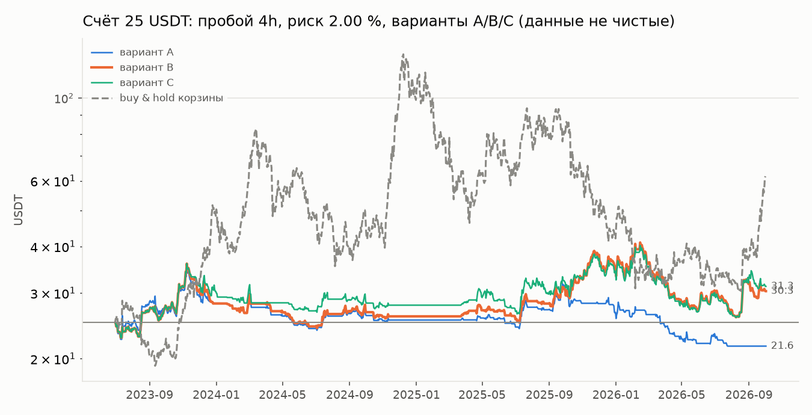

# Этап 1. Риск на уровне портфеля — итог

**Данные уже не чистые.** Вся история 2023—2026, включая бывшие отложенные полгода,
использовалась в исследовании. Цифры ниже проверяют правила риска и код. Прибыльность
они не доказывают.

Правила записаны и закоммичены до прогона: `docs/RISK_PROTOCOL.md` (коммит `33645df`).
Отклонений от них нет. Все числа — из вывода `python -m research.stage1_risk`
(`reports/stage1_risk.txt`).

## Что выбрано

| | |
|---|---|
| Стратегия | пробой канала 4h на корзине, параметры зафиксированы в центре плато: канал 38 свечей, стоп 2,5 ATR, трейлинг 4 ATR, обе стороны, без фильтров |
| Риск на сделку | **2 %** |
| Вариант риска | **B**: сумма открытого риска ≤ 6 % + риск с учётом корреляции ≤ 4 % |
| Ограничители | дневной лимит 6 %; просадка 20 % → риск вдвое; просадка 40 % → полная остановка; не больше 4 позиций; паузы после серии убытков нет |
| Ликвидность | новые входы только по монетам, прошедшим правило ликвидности (пересчёт раз в сутки) |
| Квартальный переподбор | убран |

## 1. Риск на сделку

Сигналы — 1195 входов стратегии с июля 2023 по октябрь 2026 по монетам, прошедшим
правило ликвидности. Для каждого сигнала посчитан объём при счёте 25 USDT тем же кодом,
что в бэктесте. Сигнал пропускается, если объём меньше минимального ордера биржи (5 USDT).
Медианный стоп — 6,3 % цены.

| Риск | Пропущено при 25 USDT | При 20 USDT и половинном риске | При 50 USDT |
|---|---|---|---|
| 1,00 % | 83,2 % | 100 % | 6,9 % |
| 1,25 % | 61,4 % | 99,8 % | 0,8 % |
| 1,50 % | 39,5 % | 99,2 % | 0,3 % |
| 1,75 % | 20,2 % | 97,0 % | 0 % |
| **2,00 %** | **6,9 %** | 94,5 % | 0 % |

Порог «не больше 20 % пропусков» проходит только риск 2 %. При 1,75 % пропуск 20,2 %,
это чуть выше порога.

## 2. Варианты на всей истории (июль 2023 — октябрь 2026, риск 2 %)

| Вариант | 25 USDT → | Макс. просадка | PF | Сделок | Половинный риск, доля времени | Остановка | Справочные 1000 USDT → |
|---|---|---|---|---|---|---|---|
| A — база | 21,61 (−14 %) | 40,0 % | 0,93 | 241 | 84 % | **да** | 1233 (просадка 40 %) |
| **B — + корреляция** | **30,34 (+21 %)** | **37,4 %** | 1,08 | 329 | 70 % | нет | 1559 (просадка 38 %) |
| C — + волатильность | 31,26 (+25 %) | 36,3 % | 1,08 | 353 | 59 % | нет | 1714 (просадка 38 %) |

Buy & hold корзины за тот же период: +147 %, просадка 77 %.

**Выбор по правилу протокола:**
- A доходит до остановки на 40 %;
- B снижает просадку на 2,6 п.п. относительно A — выбран B;
- C лучше B только на 1,1 п.п., меньше требуемых 2 п.п., поэтому остаётся B.

Правило «снижать риск, если просадка выше лимита» не сработало: просадка B — 37,4 %,
это меньше 40 %.

## 3. Что важно знать

1. **При 25 USDT режим половинного риска сильно тормозит торговлю и восстановление.**
   После просадки 20 % риск падает до 1 %, и большинство позиций становится меньше
   минимального ордера
   (в таблице выше пропускается 94,5 % сигналов). В варианте B счёт провёл в этом режиме
   70 % времени:
   - самый длинный эпизод — с 3 марта 2024 по 17 июля 2025 (502 дня): 67 сделок,
     счёт держался на 24–29 USDT;
   - в среднем 1,7 сделки в неделю в режиме половинного риска против 2,6 в обычном;
     проходят только сделки с узким стопом.

   Это прямое следствие ваших правил при таком депозите. Ослаблять их я не стал.
   - Для информации: тот же вариант B с депозитом 50 USDT → 91,21 USDT (+82 %),
     просадка 39,4 %, 606 сделок, половинный риск 43 % времени.
2. **Правило ликвидности отсекает много.** Доля времени, когда монета проходит правило:
   - MOVR — 3 %, QNT — 1 %: их дневной оборот почти всю историю был меньше 10 млн USDT.
     В корзину они попали по сегодняшнему обороту;
   - SAND — 37 %, HYPE — 42 % (листинг в конце 2024), NEAR — 50 % (в 2026 шаг цены
     стал крупнее 0,04 % цены), HBAR — 63 %;
   - XRP, DOGE, LINK, AVAX — 100 %.

   Около трети сигналов отсекает именно это правило. Значит, часть прибыли прежних
   бэктестов (например, MOVR +25 R в апреле 2026) приходилась на сделки, исполнение
   которых бэктест, скорее всего, приукрашивал.
3. **Перевес слабый.** На справочном капитале средний результат сделки +0,07 R
   (по годам: 2023 +0,09, 2024 +0,06, 2025 +0,15, 2026 +0,01), PF 1,11.
   Это фиксированные параметры из центра плато, без подбора. Раньше подбор
   задним числом давал +0,22 R, а эти цифры ближе к тому, чего можно ждать без
   подгонки.
4. **Просадка 37–40 % — свойство самой стратегии,** а не только маленького депозита:
   на справочном капитале она такая же (38 %).

## 4. Что дальше

- Параметры записаны в `config/bot.example.yaml`. Их использует боевой движок (этап 2).
- База для проверки на демо — распределение R сделок справочного прогона варианта B:
  `reports/stage1/baseline.json` (3,7 сделки в неделю).
- Вопрос к вам (решать не сейчас, бот работает и так): держать ли депозит 25 USDT,
  если при первой же просадке 20 % бот почти перестанет торговать. Ограничители
  я не менял.
