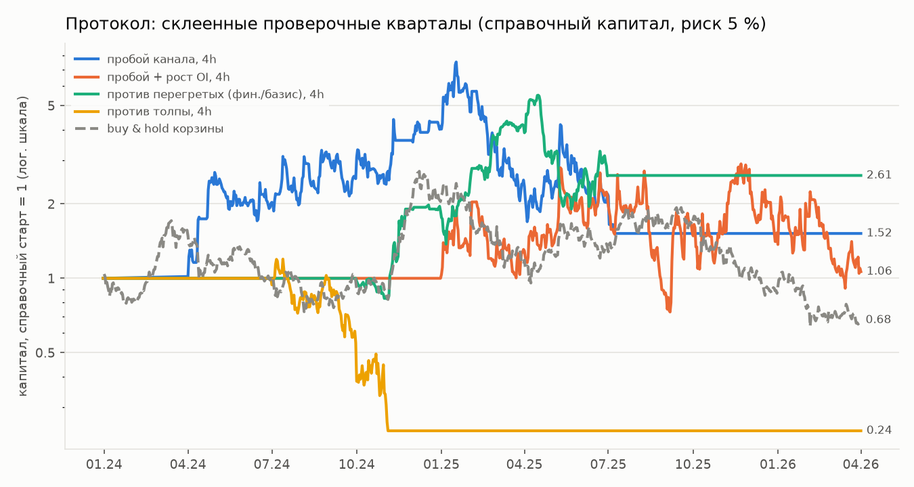
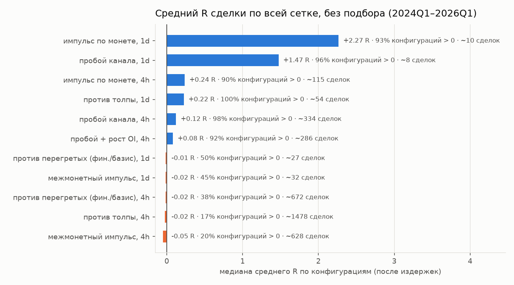
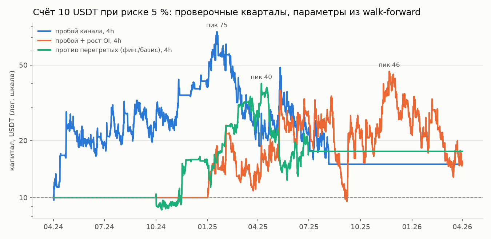
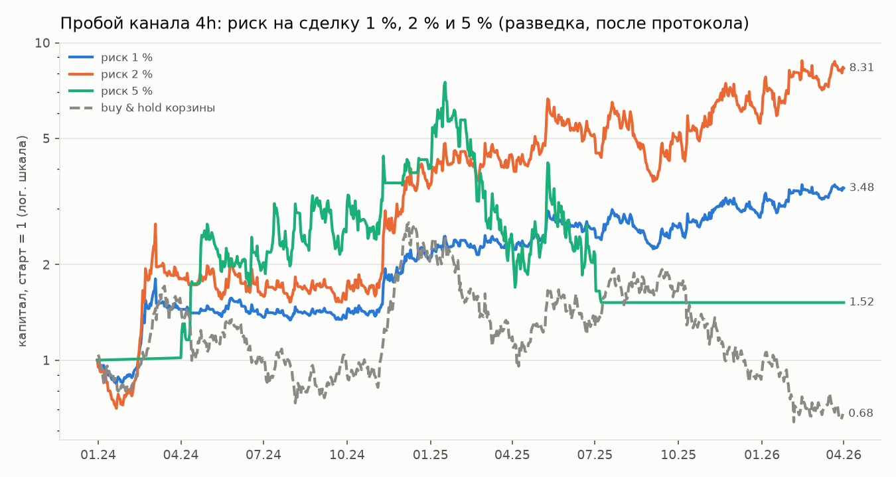

# Этап 3b. Корзина монет — итог исследования

## Короткий вывод

1. **По заранее зафиксированному протоколу финалиста нет.** Ни одна из 11 комбинаций
   «стратегия × таймфрейм» не прошла критерии отбора: при риске 5 % на сделку ни у
   одной профит-фактор (PF) на проверочных данных не достиг 1,3. Поэтому отложенные
   6 месяцев (2026-04-02 — 2026-10-02) **не открывались**: `reports/holdout_access.log` пуст.
2. **Перевес нашёлся, но не там, где мешает риск 5 %.** У трендовых стратегий на
   4-часовых свечах результат сделки устойчиво положительный: 90–98 % всех вариантов
   параметров в плюсе после издержек.
3. **Почему не прошли.** При риске 5 % и до 4 позиций одновременно сделки по
   разным монетам проигрывают вместе, и счёт проваливается на 75–80 %. Пример
   прогона на 10 USDT:
   - бот вырастил счёт до **75 USDT**;
   - затем потерял 80 % от пика и остановился на **15 USDT**.
4. **Разведка после протокола.** Тот же пробой канала на 4h при риске **1–2 %** на
   сделку дал на проверочных кварталах 2024–2026:
   - около 700 сделок, PF 1,30–1,37;
   - рост справочного капитала в 3,5–8,3 раза при просадке 26–49 %;
   - buy & hold корзины за то же время: −32 %.

   Этот вариант выбран после просмотра результатов, поэтому цифры оптимистичны. При
   поправке на все 36 сделанных попыток статистически он **не доказан**:
   дефлированный Шарп 0,46–0,50 при пороге 0,95. Честно проверить его могут только
   отложенные данные.
5. **Главное практическое ограничение — депозит 10 USDT.** При риске 1–2 % позиция
   получается меньше минимального ордера Bybit (5 USDT), и бот почти не может торговать.
   Нужен депозит:
   - от **25 USDT** при риске 2 %;
   - от **50 USDT** при риске 1 %.

Все числа — из вывода кода. Файлы с выводом:
- `reports/BASKET_DATA.md`, `basket_engine_check.txt`, `basket_audit.txt`;
- `basket_gates_wf.txt`, `basket_gates_ref60.txt`, `basket_diag.txt`;
- `basket_explore.txt`, `basket_explore2.txt`;
- таблицы и графики в `reports/basket/`.

Протокол записан и закоммичен до первого прогона: `docs/BASKET_PROTOCOL.md`.

## 1. Что сделано

- **Данные:** 15 торгуемых монет плюс BTC и ETH как сигналы, с 2023-01-01. Ряды:
  свечи 15m, финансирование, премиальный индекс (базис), открытый интерес, доля лонгов,
  индекс страха и жадности. Пропусков и дублей нет (`reports/BASKET_DATA.md`).
- **Портфельный бэктестер** (`bot/backtest/portfolio.py`):
  - общий капитал на все монеты;
  - не больше 4 позиций одновременно;
  - суммарный риск открытых позиций не больше 20 %;
  - все ваши ограничители — на уровне счёта.

  Проверки:
  - на одной монете совпадает со старым движком сделка в сделку (15 монет × 3
    стратегии × 2 размера капитала, расхождение 0,00 USDT, `basket_engine_check.txt`);
  - независимый пересчёт сделок на реальных данных: всё сходится (`basket_audit.txt`).
- **6 семейств стратегий** (`bot/strategy/basket.py`):
  - импульс по монете;
  - пробой канала;
  - межмонетный импульс или разворот;
  - «против перегретых» по финансированию и базису;
  - пробой с ростом открытого интереса;
  - «против толпы» по доле лонгов;
  - фильтры режима: тренд BTC и индекс страха и жадности.

  Причинность проверена тестом с подменой будущего, а тест ловит намеренно
  встроенные «подглядывания». Всего 162 теста проходят.
- **Walk-forward:** 9 кварталов проверки (2024Q1 — 2026Q1, 27 месяцев), подбор на
  12 месяцах перед каждым кварталом, выбор плато по SQN.

## 2. Результат по протоколу (риск 5 %, требование ≥ 200 сделок в год)

| Стратегия, ТФ | Кварталов с торговлей | Сделок | PF | Доходность (справ.) | Макс. просадка | 10 USDT → |
|---|---|---|---|---|---|---|
| пробой канала, 4h | 8 из 9 | 392 | 1,02 | +52 % | 80 % | 15,01 (остановлен) |
| пробой + рост OI, 4h | 5 | 410 | 1,00 | +6 % | 74 % | 14,97 |
| против перегретых, 4h | 3 | 288 | 1,18 | +161 % | 65 % | 17,55 |
| против толпы, 4h | 5 | 272 | 0,78 | −76 % | 80 % | 4,07 |
| межмонетный импульс, 4h | 3 | 198 | 0,64 | −80 % | 80 % | 4,79 |
| остальные 6 (все 1d и импульс 4h) | 0 | 0 | — | — | — | 10,00 |

Почему у шести комбинаций нет ни одной сделки:
- **1d-стратегии.** Медианный дневной ATR монет корзины — 7,5 % цены, поэтому
  стоп в 2–3 ATR занимает 15–23 % (`basket_diag.txt`). При 10 USDT и риске 5 %
  стоп не может быть шире ~9,5 %, иначе позиция меньше минимального ордера.
  Поэтому почти все сигналы пропускаются.
- **Импульс 4h.** Ни одна его настройка не делает 200 сделок за год при лимите в
  4 позиции.

Справочный раунд с мягким требованием частоты (≥ 60 сделок в год,
`basket_gates_ref60.txt`) финалиста тоже не дал. «Против перегретых» 4h там вырос
в 11 раз, но:
- торговал только 4 квартала из 9;
- диагностика ниже показывает, что у этой идеи в целом перевеса нет: успех дали
  несколько удачных кварталов, а не устойчивое свойство.

Buy & hold корзины за те же 27 месяцев: −32 %, Шарп 0,20, макс. просадка 76 %.

## 3. Где перевес есть, а где нет (диагностика всей сетки)

Все 400 вариантов параметров прогнаны без подбора на тех же 27 месяцах
(`basket_diag.txt`). Показан средний результат сделки в R (R — запланированный
риск сделки) после всех издержек:

- **Тренд на 4h** (импульс, пробой, пробой + OI): +0,08 … +0,24 R на сделку, в плюсе
  90–98 % вариантов. Это широкое и устойчивое свойство, а не одна удачная настройка.
  Основной вклад дают лонги (их завышает смещение выживших), но у пробоя канала
  в плюсе и шорты.
- **Тренд на 1d:** очень большой R на сделку, но сделок единицы: мешает ограничение
  стопа при 10 USDT.
- **Межмонетный импульс, «против перегретых», «против толпы» на 4h:** перевеса
  нет, у большинства вариантов результат ≤ 0. «Против толпы» на 1d: +0,22 R, но
  ~50 сделок за 27 месяцев — слишком мало для вывода.

## 4. Почему при риске 5 % перевес не превращается в прибыль

Крипта движется вместе. Когда открыты 4 позиции по 5 % риска, это фактически
одна ставка в 20 % счёта. Серия таких ставок даёт провалы на 75–80 %:
- **Пробой канала:** счёт 10 USDT вырос до 75 USDT к 18 января 2025, потом
  потерял 80 % и остановился по вашему лимиту просадки.
- **Импульс по монете:** то же самое, пик 46 USDT, затем остановка
  (`basket_explore.txt`).

Оценка Келли по проверочным сделкам — 2,6–6,4 % на сделку, половина Келли —
1,3–3,2 %. Эта оценка завышена: она считает сделки по очереди, а на деле до 4
связанных позиций открыты одновременно. Значит, разумный риск ниже 1,3–3,2 % и
заметно ниже 5 %.

## 5. Разведка: пробой канала 4h при риске 1–2 %

**Важно.** Это НЕ результат протокола, а проверка гипотезы, появившейся после
просмотра результатов. Отложенные данные не использовались.

Параметры стабильны: во всех 9 кварталах выбраны канал 20 свечей и торговля в обе
стороны, стоп 2 ATR — в 7–8 кварталах из 9.

| | Риск 1 % | Риск 2 % |
|---|---|---|
| Сделок за 27 мес. | 702 | 703 |
| PF (справочный капитал) | 1,37 | 1,30 |
| Средний R | +0,22 | +0,22 |
| Лонги / шорты, ср. R | +0,34 / +0,08 | +0,35 / +0,08 |
| Прибыльных кварталов | 7 из 9 | 6 из 9 |
| P(средний R ≤ 0), бутстрэп | 0,002 | 0,002 |
| Шарп / Кальмар | 1,44 / 2,86 | 1,51 / 3,46 |
| Макс. просадка | 26 % | 45 % |
| Издержки × 2: PF | 1,32 | 1,25 |
| Дефлированный Шарп (36 попыток) | 0,46 | 0,50 |

Реальный счёт при тех же параметрах (`basket_explore2.txt`):

| Риск | Депозит 25 USDT | 50 USDT | 100 USDT |
|---|---|---|---|
| 1 % | 77 USDT (×3,1), просадка 26 %, 542 сделки — часть сигналов мала для минимального ордера | 128 USDT (×2,6), просадка 29 % | 349 USDT (×3,5), просадка 29 % |
| 2 % | 113 USDT (×4,5), просадка 49 % | 413 USDT (×8,3), просадка 48 % | 830 USDT (×8,3), просадка 49 % |

При 10 USDT: с риском 1 % не проходит ни одна сделка, с риском 2 % — 7 %.

**Как к этому относиться.** Признаки настоящего перевеса есть:
- перевес широкий по сетке;
- параметры стабильны;
- шорты тоже в плюсе;
- результат переживает удвоенные издержки;
- бутстрэп уверенный.

Но это лучшее из 36 попыток, выбранное задним числом. Поправка на перебор
(дефлированный Шарп 0,46–0,50) говорит, что результат может быть и везением.
Кроме того, монеты отобраны по сегодняшнему обороту (смещение выживших), а 2024 год
был сильным для тренда. **Ожидать на будущем ×3–8 за два года нельзя.** Честный
ответ даст только проверка на 6 отложенных месяцах.

## 6. Ограничения

- **Смещение выживших.** Монеты отобраны по обороту на сегодня.
- **Mark-цены корзины не загружались.** Ликвидация считается по последней цене.
- **Порядок движения внутри 15-минутной свечи неизвестен.** Если в одной свече
  задеты и стоп, и тейк, считается, что первым сработал стоп.
- **Размер позиций.** Справочный капитал 1000 USDT не учитывает влияние наших
  сделок на цену; для 10–100 USDT это несущественно.
