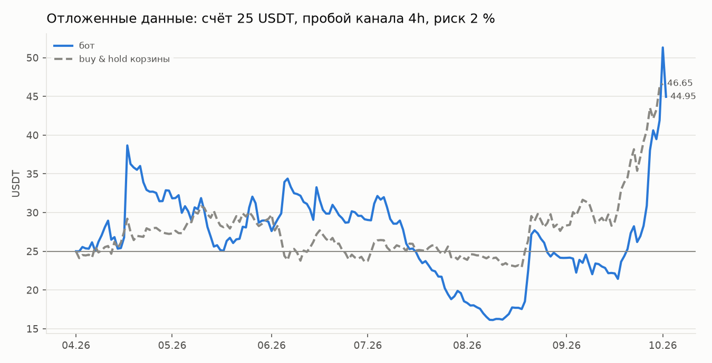

# Финальная проверка на отложенных данных — итог

**Результат: проверка НЕ пройдена.** Бот заработал, но не выполнил один из четырёх
критериев: он оказался хуже простой покупки корзины монет по соотношению доходности
и риска. По правилу, записанному до проверки, боевой запуск этой стратегии
не рекомендуется.

Условия проверки зафиксированы до обращения к данным (`docs/BASKET_PROTOCOL.md`,
раздел 8, коммит `e269808`):
- **стратегия:** пробой канала на 4-часовых свечах;
- **счёт:** 25 USDT, риск 2 % на сделку;
- **настройки** пересматриваются раз в квартал по последним 12 месяцам.

Отложенные данные открыты один раз (`reports/holdout_access.log`).

Все числа взяты из вывода кода:
- `reports/basket_holdout.txt`;
- `reports/basket_holdout_notes.txt`;
- `reports/basket_holdout_dryrun.txt` — пробный прогон на данных разработки.

## Результат: 2026-04-02 — 2026-10-02

| | Бот | Buy & hold корзины |
|---|---|---|
| 25 USDT превратились в | **44,95** (+79,8 %) | **46,65** (+86,6 %) |
| Максимальная просадка | **64,8 %** (44,86 → 15,77 USDT) | 25,5 % |
| Шарп | 1,53 | 2,36 |
| Кальмар | 3,78 | 9,70 |
| Сделок | 182 | — |
| Профит-фактор | 1,35 | — |

Выбранные настройки (оба квартала одинаковые): канал 20 свечей, стоп 2 ATR,
трейлинг 5 ATR, сделки в обе стороны, фильтр по индексу страха и жадности.

## Критерии приёмки

| Критерий | Результат | |
|---|---|---|
| Профит-фактор > 1,3 | 1,354 | выполнен |
| ≥ 100 сделок | 182 | выполнен |
| Не остановлен, просадка < 80 % | работает, 64,8 % | выполнен |
| Шарп и Кальмар лучше buy & hold | 1,53 < 2,36; 3,78 < 9,70 | **не выполнен** |

## Что показывает разбор (для информации)

- **Прибыль держится на 2–3 сделках:**
  - QNT в сентябре: +14,08 USDT (+29 R);
  - MOVR в апреле: +12,51 USDT (+25 R) — памп с 1,45 до 4,27 за 4 часа.

  Без двух лучших сделок итог всех остальных 180 сделок: −6,64 USDT.
- **Входы почти не лучше случайных.** 200 прогонов со случайными входами и теми же
  правилами выхода дали медианный PF 1,31. Стратегия лучше только 64 % из них.
  Значит, заработали в основном рост рынка (корзина +87 %) и правило «держать
  прибыльную позицию, пока идёт тренд», а не умение выбирать момент входа.
- **Лонги и шорты:**
  - лонги в среднем +0,58 R;
  - шорты в среднем −0,25 R — в растущем рынке они теряли.
- **Почти весь май—август — убытки:**
  - июль: −11,25 USDT;
  - счёт опустился до 15,77 USDT;
  - вытянул его рост рынка в сентябре.
- **Устойчивость:**
  - удвоенные издержки почти не меняют итог: 43,87 USDT, PF 1,34;
  - соседние настройки: медианный PF 1,24, у 80 % PF > 1;
  - бутстрэп сделок: вероятность убытка за такие полгода — 20 %, просадка в 95 %
    случаев до 60 %.
- **Пробный прогон на последних 6 месяцах периода разработки** (2025-10 — 2026-04,
  рынок падал): −7,3 %, PF 0,95.

## Вывод

1. Пробой канала ловит большие движения, но в боковом рынке долго теряет.
   Перевес над случайными входами за эти полгода не подтвердился.
2. На отложенных данных бот заработал +80 %, но:
   - простая покупка корзины дала больше;
   - её просадка была вдвое меньше.
3. Отложенные данные использованы. Любую новую идею можно честно проверить только на
   новых данных, которых ещё нет, — например, торговлей на демо-счёте.
