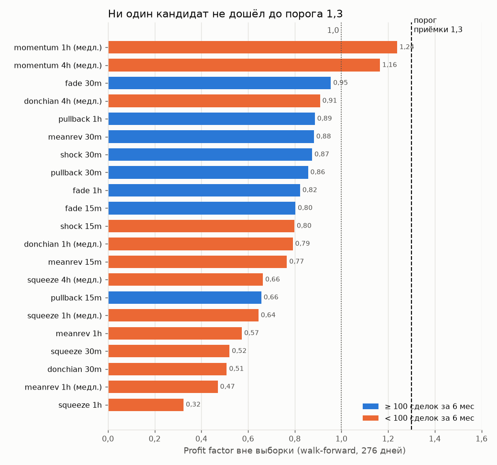
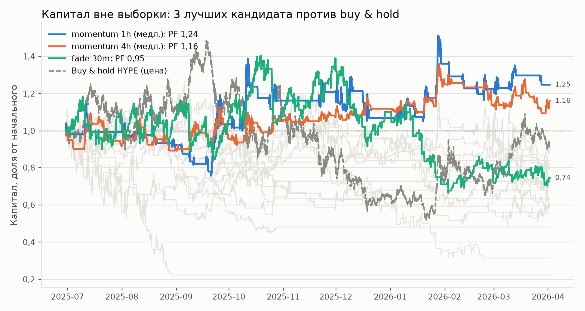
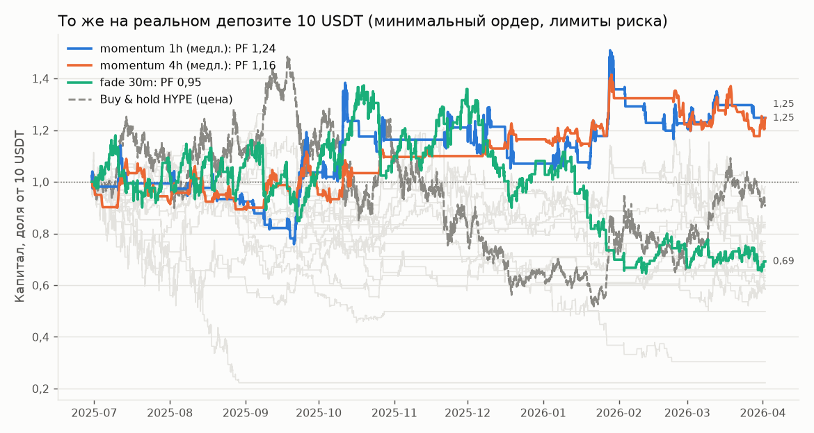

# Этап 3. Исследование стратегий — итог

## Короткий вывод

**Ни одна стратегия не прошла отбор.** Ни один из 7 типов стратегий ни на одном
таймфрейме не показал на данных вне выборки profit factor выше 1,3 при
100+ сделках за полгода. Вне выборки в walk-forward (276 дней) лучший частый
кандидат дал PF 0,95, то есть убыток.

**Отложенные 6 месяцев (2026-04-02 — 2026-10-02) не открывались.** Финальная
проверка нужна для кандидата, прошедшего отбор, а такого нет. Нетронутые
отложенные данные сохраняют ценность для следующей попытки; журнал обращений
(`reports/holdout_access.log`) пуст.

Все числа ниже — из вывода кода:
`reports/stage3_r1.txt`, `stage3_r2.txt`, `stage3_slow.txt`, `stage3_r1dec.txt`,
`stage3_r2dec.txt`, `stage3_costs_diag.txt`, `stage3_random_baseline.txt`,
`stage3_report.txt` и таблицы в `reports/stage3/`.

## Как проверялось

- **Данные:** только период разработки 2025-01-01 — 2026-04-01.
- **Walk-forward:** 180 дней подбора → 60 дней проверки, сдвиг 60 дней,
  5 окон, 276 дней вне выборки.
- **Подбор:** по SQN (средний R / разброс R × √min(n, 100)) с медианой по
  соседним значениям параметров — выбирается плато, а не случайный пик.
  Конфигурация допускается, только если в окне подбора ≥ 90 сделок (иначе не
  будет 100 сделок за полгода). Если допустимых прибыльных конфигураций нет,
  стратегия в следующем окне не торгует.
- **Реализм:** комиссии вашего уровня, проскальзывание, исполнение стопа хуже
  цены, финансирование, ликвидация, все ограничители риска. Состояние
  ограничителей переходит из окна в окно. Результат считается и на «справочном»
  капитале 1000 USDT (чистый перевес), и на реальных 10 USDT.
- **Причинность:** каждая стратегия автоматически проходит проверки обрезки и
  подмены будущего (`tests/test_candidates.py`).
- **Перебор:** раунд 1 — 1 044 конфигурации (4 типа × 4 таймфрейма), раунд 2 —
  540 (3 типа × 3 таймфрейма); плюс повторы тех же сеток со смягчённым
  требованием частоты (522) и с декабрём 2024 (1 584). Всего ≈ 20 000 прогонов
  подбора.

## Кандидаты

| Тип | Стратегия | Фильтр режима |
|---|---|---|
| Пробой/тренд | канал Дончиана, трейлинг-стоп | ER ≥ порога |
| Импульс | доходность за L свечей в единицах волатильности | ER ≥ порога |
| Возврат к среднему | z-оценка от EMA, тейк на EMA, выход по времени | ER ≤ порога |
| Пробой волатильности | пробой после сжатия полос Боллинджера | — |
| Раунд 2: против пробоя | вход против пробоя канала, тейк/стоп в ATR | ER ≤ порога |
| Раунд 2: откат по тренду | RSI(2) в направлении растущей/падающей EMA | тренд EMA |
| Раунд 2: отскок после шока | свеча ≥ k·σ на объёме ≥ m·медианы (ликвидации) | — |

ER — коэффициент эффективности Кауфмана: 1 — чистый тренд, 0 — «пила».

## Результаты вне выборки (walk-forward, 276 дней)

Только варианты, совершившие сделки. «Сделок/6 мес» — темп на справочном
капитале; «10 USDT» — итог реального депозита с минимальным ордером и лимитами.

| Кандидат | ТФ | Сделок/6 мес | PF | Средний R | 10 USDT: итог | 10 USDT: макс. просадка |
|---|---|---|---|---|---|---|
| против пробоя | 30m | 288 | 0,95 | −0,005 | −30,8 % | 51,9 % |
| откат по тренду | 1h | 203 | 0,89 | −0,011 | −16,5 % | 19,8 % |
| возврат к среднему | 30m | 206 | 0,88 | −0,024 | −41,6 % | 45,6 % |
| отскок после шока | 30m | 104 | 0,87 | −0,021 | −23,0 % | 36,1 % |
| откат по тренду | 30m | 185 | 0,86 | −0,023 | −34,0 % | 41,6 % |
| против пробоя | 1h | 147 | 0,82 | −0,083 | −69,6 % | 74,7 % |
| против пробоя | 15m | 134 | 0,80 | −0,115 | −77,8 % | 78,4 % |
| отскок после шока | 15m | 98 | 0,80 | −0,038 | −23,8 % | 40,9 % |
| возврат к среднему | 15m | 81 | 0,77 | −0,064 | −36,3 % | 38,9 % |
| откат по тренду | 15m | 134 | 0,66 | −0,067 | −50,2 % | 57,7 % |
| возврат к среднему | 1h | 26 | 0,57 | −0,149 | −28,9 % | 34,0 % |
| пробой волатильности | 30m | 11 | 0,52 | −0,213 | −17,8 % | 23,0 % |
| пробой (Дончиан) | 30m | 17 | 0,51 | −0,318 | −37,0 % | 43,6 % |
| пробой волатильности | 1h | 15 | 0,32 | −0,304 | −30,6 % | 32,2 % |

Остальные сочетания (пробой 15m/1h/4h, импульс на всех ТФ, пробой
волатильности 15m/4h, возврат к среднему 4h, отскок 1h) **не нашли в окнах
подбора ни одной допустимой прибыльной конфигурации** и не торговали.

Buy & hold HYPE за тот же период: −14,6 %, просадка 67 %, Sharpe 0,30, Calmar −0,28.

## Почему так: диагностика

1. **У частых стратегий нет перевеса даже без издержек.** Все конфигурации на
   всём периоде разработки с нулевыми комиссиями и проскальзыванием: у
   вариантов со 100+ сделками за полгода медианная сделка **+0,006R**, лучшая из
   112 — +0,111R (при таком числе попыток это ожидаемый результат удачи). С
   обычными издержками медиана −0,030R. Снижение комиссий (лимитные ордера)
   поэтому не помогает: делить нечего.
2. **Издержки задают «цену входа в игру».** Случайные входы: без издержек
   средняя сделка −0,011R (≈ 0 — бэктестер не искажает результат), с вашими
   издержками −0,084R на 15m и −0,053R на 1h. Каждая сделка без перевеса стоит
   5–8 % от суммы риска.
3. **Пробои на коротких таймфреймах HYPE не продолжаются.** Пробой канала на
   15m даже без издержек дал медиану −0,268R — хуже случайных входов.
   Стратегия «против пробоя» эту закономерность не превратила в прибыль после
   издержек (PF 0,80–0,95).
4. **Медленные стратегии красивы на подборе, но не вне выборки.** Пробой
   волатильности на 4h: на всём периоде разработки 92 % конфигураций в плюсе,
   медиана +0,31R — но ~13 сделок за полгода, а в walk-forward без требования
   частоты PF 0,66. Классическая подгонка, которую walk-forward и должен ловить.
5. **Решение исключить декабрь 2024 на вывод не влияет.** С декабрём лучшие
   результаты: «отскок после шока» 15m PF 1,02 (81 сделка/6 мес), «против
   пробоя» 30m PF 1,00, возврат к среднему 15m PF 0,99 — тоже ниже 1,3.

## Единственный «почти кандидат»: импульс на 1h/4h

Найден только в справочном прогоне **без требования 100 сделок** (минимум 15
сделок в окне подбора) — то есть по условиям задачи он не допускается.

| | Импульс 1h | Импульс 4h | Buy & hold |
|---|---|---|---|
| Сделок вне выборки (темп за 6 мес) | 42 (28) | 58 (38) | — |
| PF | 1,24 | 1,16 | — |
| Средний R | +0,159 | +0,072 | — |
| 10 USDT: итог за 276 дней | +24,8 % | +24,7 % | −14,6 % |
| 10 USDT: макс. просадка | 28,7 % | 17,0 % | 67 % |
| Sharpe / Sortino / Calmar | 0,77 / 1,39 / 1,18 | 0,88 / 1,52 / 1,99 | 0,30 / — / −0,28 |
| PF при удвоенных издержках | 1,13 | 1,09 | — |
| Монте-Карло: P(просадка ≥ 80 %) | 0,0 % | 0,0 % | — |
| Бутстрэп сделок: P(убыток) | 33 % | 34 % | — |

С поправкой на риск это лучше buy & hold, но:
- PF ниже порога 1,3 и сделок в 3–4 раза меньше требуемого;
- 2 из 5 окон проверки убыточны у обоих вариантов, параметры от окна к окну
  меняются (L = 12 ↔ 48);
- бутстрэп даёт треть шансов на убыток — статистически перевес не доказан.

## Что это значит

**При заданных критериях запускать бота на реальные деньги не рекомендую.**
Торговля без доказанного перевеса — это ожидаемый убыток в размере издержек:
по измеренной стоимости сделки без перевеса (−0,05…−0,08R) и 200 сделках за
полгода при риске 5 % это потеря порядка 41–57 % депозита за полгода
(расчёт: (1 − 0,05 × 0,053)^200 ≈ 0,59; (1 − 0,05 × 0,084)^200 ≈ 0,43).

## Варианты дальше

1. **Смягчить требование частоты** (например, ≥ 30 сделок за полгода) и один
   раз проверить импульс 1h/4h на отложенных данных. Быстро, но доказательность
   слабая: за полгода будет ~15–20 сделок, PF > 1,3 на такой выборке легко
   получить случайно — и так же легко не получить при реальном перевесе.
2. **Добавить данные, которые несут информацию о толпе на деривативах:**
   открытый интерес, соотношение лонгов/шортов, ставки финансирования как сигнал
   (публичные эндпоинты Bybit — скачиваются тем же способом, что и свечи).
   Остаёмся на одном инструменте; шанс найти перевес выше, чем у чисто ценовых
   правил.
3. **Торговать импульс на корзине монет** (HYPE + SOL, SUI, DOGE, AVAX и т. п.)
   на 4h: сделок станет в несколько раз больше, импульс на криптовалютах —
   один из наиболее устойчивых описанных эффектов. Это меняет условие
   «один инструмент».
4. **Строить торговый движок (этап 4) и гонять демо как техническую проверку**,
   не включая реальную торговлю, пока не появится стратегия, прошедшая отбор.
   Движок понадобится при любом из вариантов 1–3.

Увеличение депозита само по себе не помогает: на справочном капитале 1000 USDT
результаты те же — дело не в минимальном ордере, а в отсутствии перевеса.
