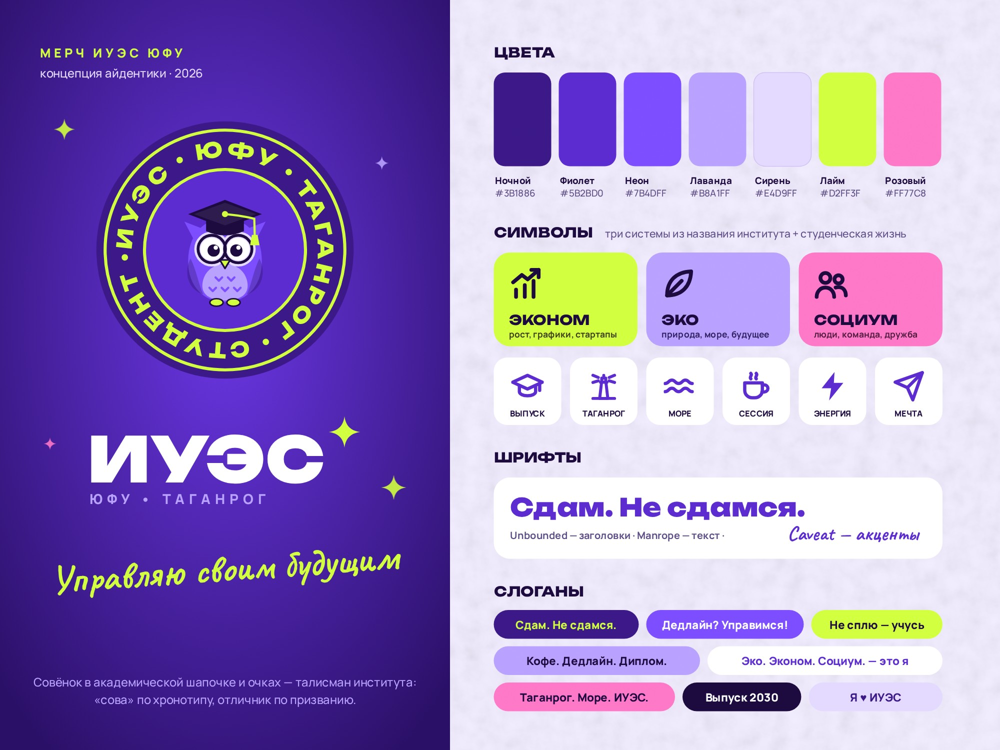
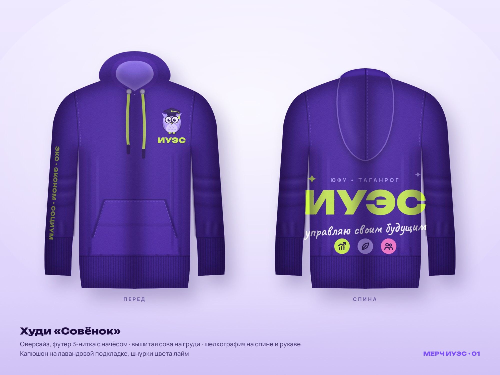
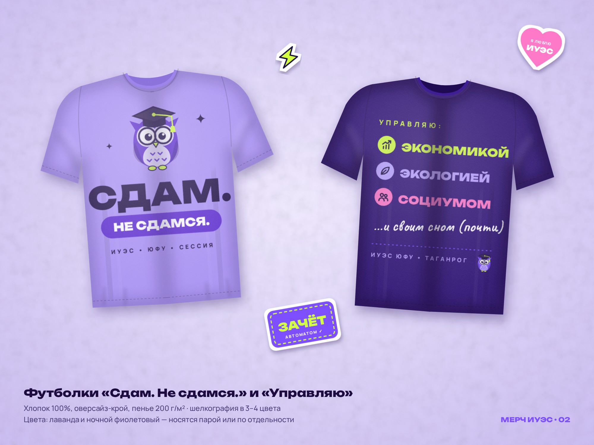
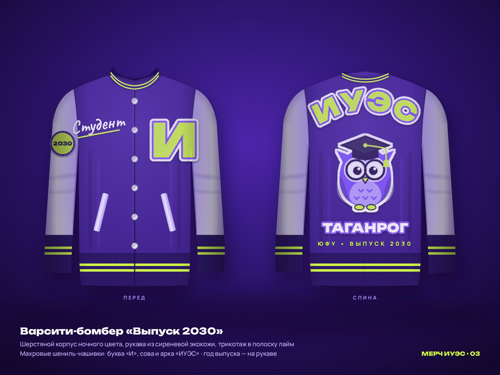
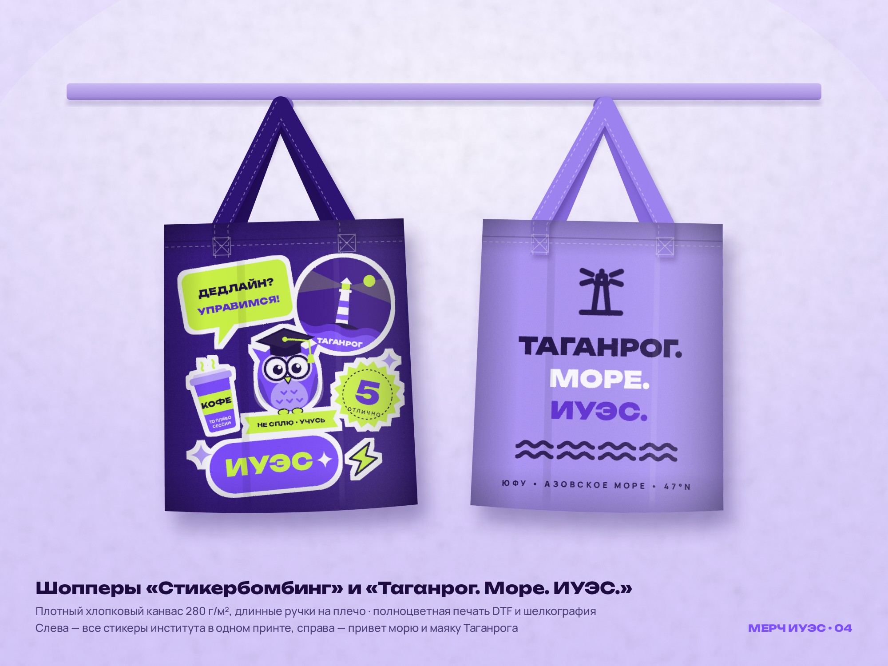
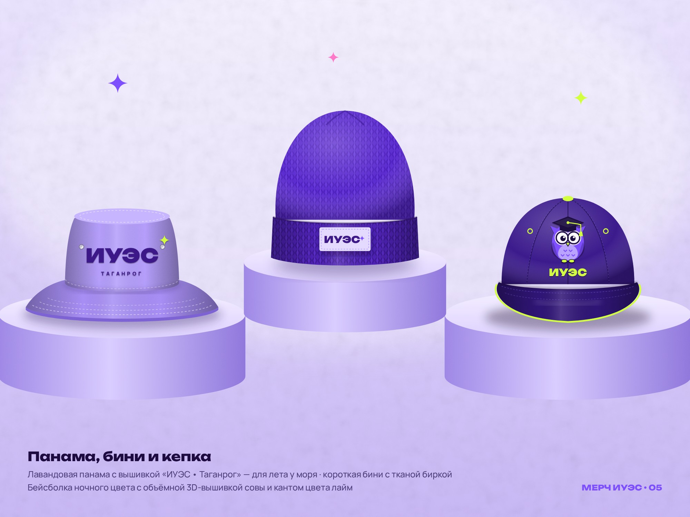
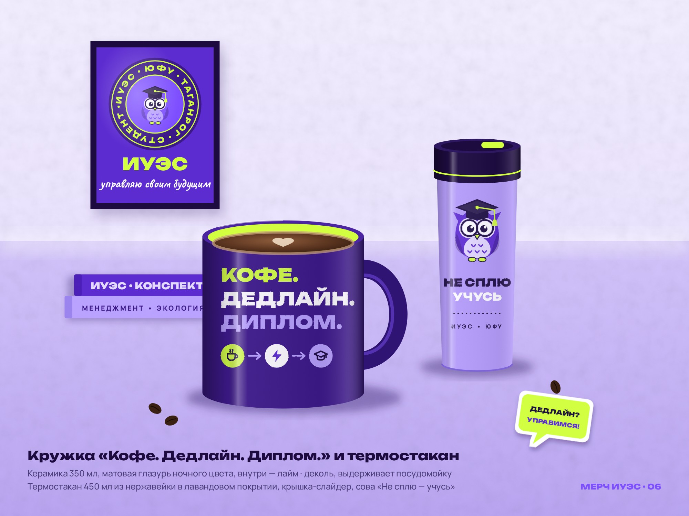
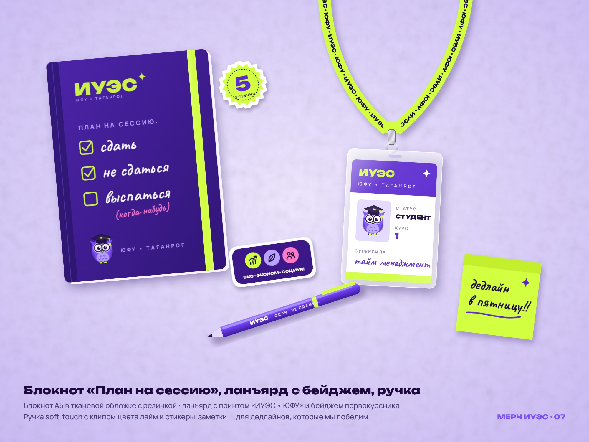

# Мерч ИУЭС ЮФУ — концепция

Мерч для Института управления в экономических, экологических и социальных системах ЮФУ (Таганрог).
Основной цвет — фиолетовый, акцент — кислотный лайм. Символы — студенческая жизнь, молодость
и три «системы» из названия института.

> Изображения в `photos/` — это визуализации (макеты), отрисованные из SVG, а не фотографии
> готовых изделий. Для производства исходники принтов берутся из `src/`.



## Идея

- **Талисман — «Совёнок ИУЭС»**: сова в академической шапочке и круглых очках. Студенты — «совы»
  по хронотипу и отличники по призванию. Кисточка шапочки и лапки — цвета лайм.
- **Три системы из названия**: график роста (экономика), лист (экология), люди (социум).
- **Таганрог**: маяк, волны Азовского моря.
- **Студенчество**: зачёт, кофе перед парой, дедлайны, пятёрка, выпускная шапочка, «Выпуск 2030».

## Палитра

| Цвет     | HEX       | Где используется                   |
|----------|-----------|------------------------------------|
| Ночной   | `#3B1886` | основной цвет изделий              |
| Фиолет   | `#5B2BD0` | принты, фоны                       |
| Неон     | `#7B4DFF` | сова, стикеры                      |
| Лаванда  | `#B8A1FF` | светлые изделия, «эко»             |
| Сирень   | `#E4D9FF` | фоны, подложки                     |
| Лайм     | `#D2FF3F` | акцент: шнурки, вышивка, надписи   |
| Розовый  | `#FF77C8` | точечный акцент, «социум»          |

Шрифты: **Unbounded** (заголовки), **Manrope** (текст), **Caveat** (рукописные акценты).
Все три со свободной лицензией OFL и с кириллицей, лежат в `fonts/`.

## Слоганы

«Сдам. Не сдамся.» · «Дедлайн? Управимся!» · «Не сплю — учусь» · «Кофе. Дедлайн. Диплом.» ·
«Управляю своим будущим» · «Управляю: экономикой, экологией, социумом… и своим сном (почти)» ·
«Таганрог. Море. ИУЭС.» · «Выпуск 2030» · «Я ♥ ИУЭС»

## Изделия

### 01 · Худи «Совёнок»
Оверсайз, футер с начёсом. Вышитая сова на груди, большой принт «ИУЭС» на спине,
«Эко • Эконом • Социум» на рукаве, лавандовая подкладка капюшона, шнурки цвета лайм.



### 02 · Футболки «Сдам. Не сдамся.» и «Управляю»
Лавандовая и тёмная, хлопок 100%, шелкография.



### 03 · Варсити-бомбер «Выпуск 2030»
Классическая студенческая куртка: шерстяной корпус, рукава из сиреневой экокожи, трикотаж в полоску лайм,
шениль-нашивки (буква «И», сова, арка «ИУЭС»).



### 04 · Шопперы
«Стикербомбинг» со всеми стикерами института и «Таганрог. Море. ИУЭС.» с маяком.



### 05 · Панама, бини, кепка
Панама с вышивкой «ИУЭС • Таганрог», бини с тканой биркой, бейсболка с 3D-вышивкой совы.



### 06 · Кружка и термостакан
«Кофе. Дедлайн. Диплом.» и «Не сплю — учусь».



### 07 · Блокнот, ланъярд с бейджем, ручка
Блокнот «План на сессию», ланъярд «ИУЭС • ЮФУ» с бейджем первокурсника, ручка и стикеры-заметки.



## Как устроено и как перерисовать

```
merch/
├── fonts/          шрифты (OFL) и fonts.css
├── src/
│   ├── shared.css  палитра и базовые стили
│   ├── shared.js   общие SVG: сова, эмблема, иконки, стикеры, фильтры фактур
│   └── NN-*.html   по одной сцене на изделие (1600×1200)
├── photos/         готовые визуализации (JPG)
└── render.cjs      рендер сцен в JPG через Playwright
```

Каждую сцену можно открыть в браузере напрямую. Чтобы пересобрать картинки:

```bash
node merch/render.cjs          # все сцены
node merch/render.cjs 01-      # только худи
```

Нужен Playwright с Chromium (`npm i -g playwright`).
